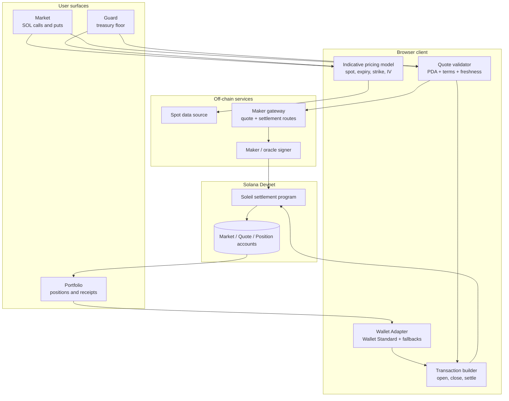
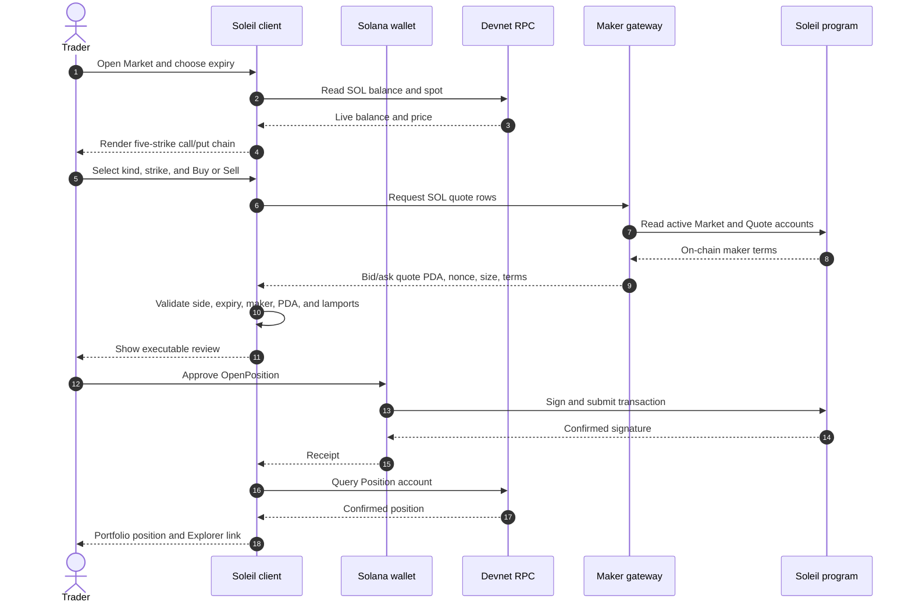
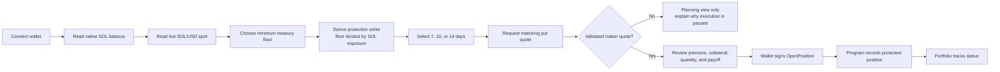
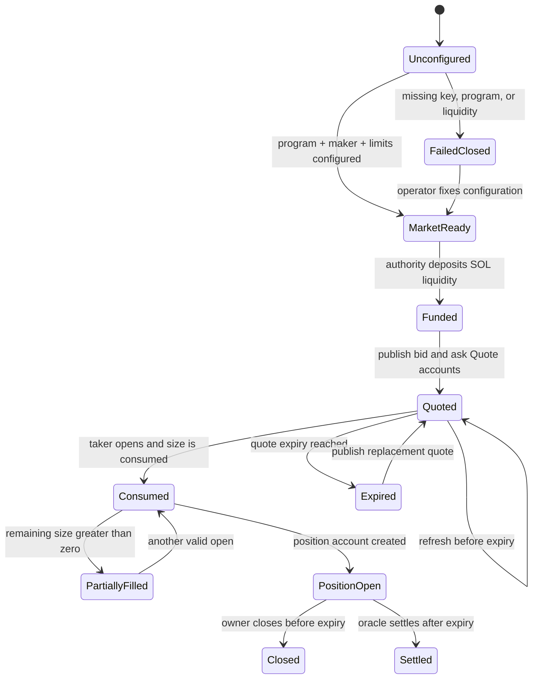
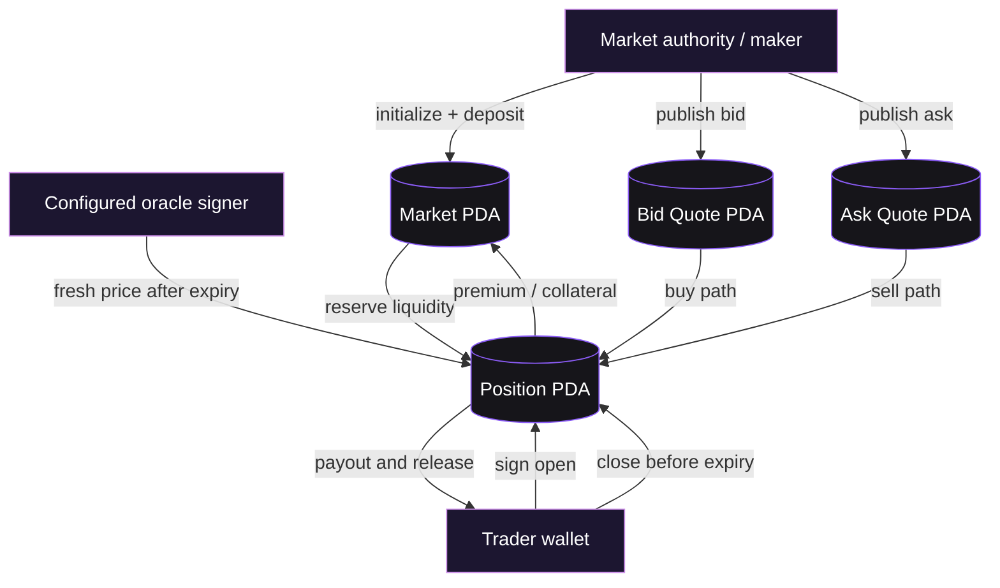
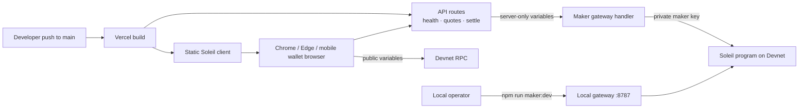
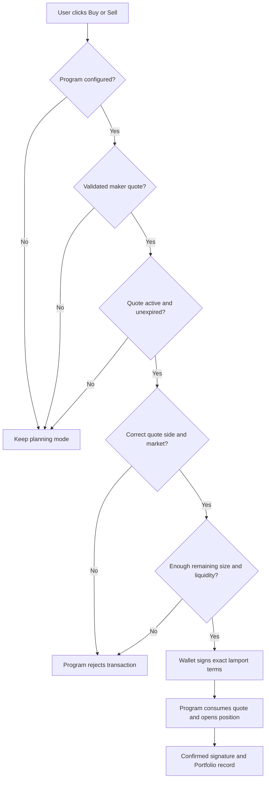

<p align="center">
  

</p>

<h1 align="center">Soleil</h1>

<p align="center">
  <strong>SOL options and treasury protection, built for Solana.</strong>
</p>

<p align="center">
  <a href="https://soleil-chi-three.vercel.app/#market"></a>
  <a href="https://explorer.solana.com/address/3xZZq7Wd23M1eyggca8KCbhNx6FcNpsKTHGJq751n66k?cluster=devnet"></a>
  <a href="https://github.com/debojyoti10CC/soleil/actions"></a>
  
</p>

---

## At a glance

Soleil is a focused SOL options venue with a wallet-aware protection workflow. It concentrates the product on one underlying asset so expiries, strikes, collateral, and maker attention do not fragment across a long tail of empty markets.

- **Market** — inspect live SOL spot, choose 7, 10, or 14 days, select a call or put, and review a five-strike chain.
- **Guard** — turn a wallet's SOL exposure and a treasury floor into a simple downside-protection plan.
- **Portfolio** — discover confirmed Soleil positions from the deployed Solana program and open the relevant Explorer receipt.
- **Devnet execution** — connect a Solana wallet, validate an on-chain maker quote, sign the position transaction, and close or settle it through the program.
- **Maker gateway** — initialize markets, fund bounded liquidity, publish separate bid/ask quote accounts, and settle expired positions through an operator signer.
- **Honest fallback** — indicative prices remain visible for planning, but the client never turns a model price into a fake fill or receipt.

**Live demo:** [soleil-chi-three.vercel.app](https://soleil-chi-three.vercel.app/#market)

## The problem

SOL holders can hold an asset, trade perps, borrow against it, or buy an option, but those actions rarely share one understandable risk workflow. A treasury can be economically exposed to SOL while its protection sits in a separate venue, with no simple view of the value it is trying to preserve.

Options interfaces also fragment liquidity across many assets, expiries, and strikes. Every additional underlying creates more markets for traders and makers to maintain.

Soleil starts with one clear action: **protect the SOL you already hold.**

## The product

### Market: a concentrated SOL options chain

The Market view is a compact trading surface for SOL calls and puts:

1. Connect a Solana wallet and switch it to Devnet.
2. Read the live SOL/USD price and 24-hour move.
3. Choose a 7-, 10-, or 14-day expiry.
4. Select a strike derived from current spot rather than a hard-coded table.
5. Choose **Buy** or **Sell**.
6. Review premium, proceeds, collateral, payoff at expiry, IV, and Greeks.
7. When executable maker terms are available, sign the position-open transaction.
8. Track the confirmed position in Portfolio.

The first product slice is SOL-only. Concentrating activity around SOL gives a future maker network one venue to quote deeply instead of dozens of thin token markets.

### Guard: protection without options jargon

Guard turns a treasury objective into an option plan. It reads the connected wallet's native SOL balance, converts it to a live USD value, accepts a minimum treasury floor, derives a protection strike, and estimates the matching put's premium and payoff. With a validated maker quote, the user signs the same verified on-chain put position used by Market.

The user starts with “how much SOL value must I preserve?” rather than “which option contract do I understand?”

### Portfolio: positions from chain state

Portfolio shows wallet value, net SOL exposure, open positions, and protection status. With a configured program it queries Soleil position accounts from Devnet. Browser storage is used only for confirmed Explorer links and presentation state; it is not the source of truth for positions.

## Implemented capabilities

| Area | What is implemented |
| --- | --- |
| Wallets | Solana Wallet Adapter with Wallet Standard discovery plus Phantom and Solflare fallbacks |
| Network | Solana Devnet RPC, network badge, wallet balance reads, faucet link, and Explorer links |
| Market data | Live SOL/USD spot, 24-hour change, TradingView chart surface, live-derived strikes, and expiry tabs |
| Pricing | Explicit indicative model using intrinsic value, time value, expiry scaling, IV scaling, and bid/ask spread |
| Options UI | Calls, puts, buy/sell side, quantity, limit price, premium/proceeds, collateral, payout, Greeks, and payoff preview |
| Quote boundary | Validated maker quote JSON with quote PDA, maker, nonce, expiry, premium terms, and collateral terms |
| Settlement client | Typed PDA derivation plus builders for market, quote, liquidity, open, close, and settle instructions |
| On-chain program | Native SOL market lifecycle, quote checks, liquidity reservation, premiums, short collateral, close, and expiry settlement |
| Maker service | Market initialization, liquidity deposits, bounded bid/ask quote publication, quote refresh, and oracle settlement |
| Portfolio | Program-account position discovery, open/closed/settled filters, and confirmed transaction receipts |
| Responsive UI | Desktop and mobile layouts with a responsive chain table, order ticket, Guard planner, and Portfolio view |

## Architecture

```mermaid
flowchart LR
    W[Solana wallet] --> UI[Soleil React client]
    UI --> M[Market]
    UI --> G[Guard]
    UI --> P[Portfolio]
    UI -->|spot + balances| RPC[Solana Devnet RPC]
    UI -->|validated quote request| Q[/api/quotes or maker gateway]
    Q --> MG[Maker gateway]
    MG --> RPC
    MG -->|maker signs| PROG[Soleil settlement program]
    UI -->|wallet-signed open / close| PROG
    MG -->|oracle-signed expiry settle| PROG
    PROG --> POS[Market, Quote, Position accounts]
    POS --> P
```

## System showcase

The complete product has three user surfaces, two execution paths, and one on-chain source of truth. The model quote is useful for discovery; only a validated quote account can enter the transaction path.

### 1. Product-to-protocol map



### 2. Market user journey



### 3. Guard protection journey



### 4. Maker quote lifecycle



### 5. On-chain account relationships



### 6. Deployment topology



The public client can be deployed without a signing key. The API routes return `configured: false` or an execution error until the server-side maker keypair, program ID, liquidity budget, quote size, and collateral terms are present. This is intentional: a missing operator is surfaced as a planning state instead of fabricated liquidity.

### 7. Execution guardrails



### Web application

The Vite + React client owns product state, responsive presentation, wallet connection, transaction signing, and account discovery.

| File | Responsibility |
| --- | --- |
| `src/App.tsx` | Market, Guard, Portfolio, order entry, modal review, and user flows |
| `src/domain.ts` | Option series, expiry, strike, payoff, exposure, and protection calculations |
| `src/solana.ts` | Wallet/RPC helpers, balance reads, program-account queries, faucets, and Explorer URLs |
| `src/settlement.ts` | PDA derivation and explicit instruction layouts matching the Rust program |
| `src/quotes.ts` | Maker gateway requests, quote validation, and expiry settlement requests |
| `src/styles.css` | Soleil theme, chart surface, tables, tickets, breakpoints, and mobile layout |

### Native Solana program

`programs/soleil-settlement` is the deployed Rust program. It implements one market PDA per SOL strike, expiry, and option kind; authority-published quote PDAs; side, freshness, remaining-size, and market checks; funded liquidity with reserved open notional; native SOL premiums; quote-defined short collateral; owner close; oracle expiry settlement; and call/put intrinsic payout calculation.

The integration crate runs funding, initialization, quote, open, reserved-withdrawal, and close under Solana `ProgramTest`.

### Maker gateway

`maker-gateway/server.mjs` is an operator service, not a browser-side market simulator. It fails closed unless a deployed program, maker keypair, liquidity budget, quote size, and collateral amount are configured.

For each selected expiry it can derive five strikes, initialize missing markets, deposit bounded SOL liquidity, publish separate maker-buy and maker-sell quote accounts, return only active on-chain references, refresh expired quotes, and sign expiry settlement as the configured oracle. Vercel adapters expose the same service as `/api/health`, `/api/quotes`, and `/api/settle`.

## Quote and settlement lifecycle

```text
Live SOL spot
    |
    v
Expiry + strike chain
    |
    +--> Indicative model quote (planning only)
    |
    +--> Maker quote PDA + exact SOL terms
                |
                v
        Taker wallet signs OpenPosition
                |
                v
     Program consumes quote size and records Position
                |
        +-------+--------+
        |                |
        v                v
 Owner closes       Oracle settles after expiry
        |                |
        +-------+--------+
                v
        Portfolio reads confirmed state
```

The program, rather than the frontend, verifies the quote and moves SOL. A quote must be active, unexpired, the correct side, the correct market, and large enough for the requested quantity. This prevents stale, oversized, mismatched, or replayed quote metadata from becoming a position.

### On-chain account model

| Account | PDA seeds | Purpose |
| --- | --- | --- |
| `Market` | `market`, `SOL`, strike cents, expiry, kind | Authority, oracle, expiry, strike, liquidity, and reserved notional |
| `Quote` | `quote`, market, maker, nonce | Side, price, size, fill state, expiry, premium, and collateral terms |
| `Position` | `position`, owner, market, expiry | Owner, side, quantity, entry, lifecycle status, collateral, payout, and reserved lamports |

The Rust instruction enum and the TypeScript builders share the same explicit Borsh layout. The supported instructions are `InitializeMarket`, `OpenPosition`, `ClosePosition`, `Settle`, `PublishQuote`, `DepositLiquidity`, and `WithdrawLiquidity`.

### API contract

| Route | Method | Role |
| --- | --- | --- |
| `/api/health` | `GET` | Reports whether the server has a complete operator configuration |
| `/api/quotes` | `GET` | Returns active, bounded bid/ask quote references for `SOL` and the selected expiry |
| `/api/settle` | `GET` | Reads an expired market/position pair and submits oracle-signed settlement |

The quote response must carry exact `expiryAt` and `expiryLabel`, a strike, numeric bid/ask/IV values, and separate executable bid and ask terms: quote PDA, maker, nonce, premium lamports per SOL, and positive collateral lamports per SOL. If that contract is not satisfied, the browser refuses to submit.

## Devnet deployment

The settlement program is deployed on Solana Devnet:

- **Program:** [`3xZZq7Wd23M1eyggca8KCbhNx6FcNpsKTHGJq751n66k`](https://explorer.solana.com/address/3xZZq7Wd23M1eyggca8KCbhNx6FcNpsKTHGJq751n66k?cluster=devnet)
- **Program-data account:** [`GyBq7QKwRBM51XWYLxD847kaJCxdsv9s51Uiu2mBTz4p`](https://explorer.solana.com/address/GyBq7QKwRBM51XWYLxD847kaJCxdsv9s51Uiu2mBTz4p?cluster=devnet)
- **Deployment transaction:** [`4okq6ufR6Ejur8EuxmnyVHNwqnehcsREiFKCtmXtoxSNaPRCyzTabCtGV96o2Qq1TETF4RREWRt6baKXLQqLWM6T`](https://explorer.solana.com/tx/4okq6ufR6Ejur8EuxmnyVHNwqnehcsREiFKCtmXtoxSNaPRCyzTabCtGV96o2Qq1TETF4RREWRt6baKXLQqLWM6T?cluster=devnet)
- **Deployment slot:** `503929520` · `2026-09-25T09:47:17Z`
- **RPC:** [`api.devnet.solana.com`](https://api.devnet.solana.com)
- **Frontend:** [soleil-chi-three.vercel.app](https://soleil-chi-three.vercel.app/#market)
- **Deployment details:** [`docs/DEPLOYMENT.md`](docs/DEPLOYMENT.md)

The deployed bytes are checked against `target/deploy/soleil_settlement.so` (120,552 bytes; SHA-256 `8852b216462933aa9489607a4ece4a08e3135c76b43679baa117e4ad80efb3a0`). The integration crate is a local `ProgramTest` harness, not a second deployable program.

## Run locally

### Prerequisites

- Node.js 20.x
- Rust and Solana CLI for program work
- A Solana wallet extension for signing in Chrome or Edge
- Devnet SOL for the connected wallet and maker operator

### Start the web app

```bash
npm install
npm run dev
```

Open `http://127.0.0.1:4173/`, connect a wallet, and switch it to Devnet. The Codex in-app browser does not inject extension wallets; use Chrome, Edge, or a wallet's mobile in-app browser for signing.

### Start the executable quote service

Copy `.env.example` to `.env` and configure the server-only values:

```powershell
$env:SOLEIL_RPC_URL = "https://api.devnet.solana.com"
$env:SOLEIL_PROGRAM_ID = "<deployed-program-id>"
$env:SOLEIL_MAKER_KEYPAIR = "C:\path\to\maker-keypair.json"
$env:SOLEIL_MARKET_LIQUIDITY_LAMPORTS = "5000000000"
$env:SOLEIL_QUOTE_SIZE_LAMPORTS = "1000000000"
$env:SOLEIL_COLLATERAL_LAMPORTS_PER_SOL = "1000000000"
$env:VITE_SOLEIL_QUOTES_URL = "http://127.0.0.1:8787/quotes"
```

Then run:

```bash
npm run maker:dev
npm run dev
```

Check `http://127.0.0.1:8787/health` before attempting an order. If the gateway is absent or incomplete, the app stays in planning mode and displays why execution is unavailable.

## Environment variables

### Browser-safe variables

```text
VITE_SOLANA_RPC_URL=https://devnet.rpcpool.com
VITE_SOLEIL_PROGRAM_ID=<deployed-program-id>
VITE_SOLEIL_QUOTES_URL=/api/quotes
VITE_SOLEIL_SETTLEMENT_URL=/api/settle
```

These values are bundled into the browser and must never contain a private key.

### Server-only variables

```text
SOLEIL_RPC_URL=https://api.devnet.solana.com
SOLEIL_PROGRAM_ID=<deployed-program-id>
SOLEIL_MAKER_KEYPAIR=<JSON secret array or server-side keypair path>
SOLEIL_MARKET_LIQUIDITY_LAMPORTS=100000000
SOLEIL_QUOTE_SIZE_LAMPORTS=100000000
SOLEIL_COLLATERAL_LAMPORTS_PER_SOL=1000000000
SOLEIL_QUOTE_TTL_SECONDS=600
```

`SOLEIL_MAKER_KEYPAIR` is intentionally excluded from Git and from the client environment. Keep it in a Vercel server-side secret or a local operator environment only.

## Commands and checks

| Command | Purpose |
| --- | --- |
| `npm run dev` | Start the Vite client on the local development port |
| `npm run maker:dev` | Start the local executable quote and settlement gateway |
| `npm run maker:check` | Syntax-check the gateway |
| `npm run check` | Run the TypeScript compiler without emitting |
| `npm test -- --run` | Run the Vitest unit suite |
| `npm run build` | Type-check and build the production client |
| `cargo test -p soleil-settlement` | Run native program unit tests |
| `cargo test -p soleil-settlement-integration` | Run the local end-to-end ProgramTest lifecycle |

## Repository map

```text
src/
├── App.tsx                    product views and transaction flows
├── domain.ts                  option, payoff, expiry, and protection models
├── solana.ts                  wallets, RPC, balances, accounts, Explorer
├── settlement.ts              PDA and instruction builders
├── quotes.ts                  maker quote and settlement API client
└── styles.css                 product theme and responsive layout

api/
├── health.mjs                 Vercel gateway health route
├── quotes.mjs                 Vercel maker quote route
└── settle.mjs                 Vercel expiry settlement route

maker-gateway/                 Devnet maker/oracle operator service
programs/soleil-settlement/    native Solana settlement program
programs/soleil-settlement-integration/  ProgramTest lifecycle
docs/                          product, protocol, maker, demo, and deployment docs
scripts/                       Devnet deployment and operator scripts
public/                        logo, favicon, and Solana assets
```

## What Soleil does not claim yet

This is a Devnet reference implementation and product demo, not a mainnet-ready derivatives venue. Before accepting meaningful funds, Soleil still needs an independent production oracle with confidence and dispute handling, stronger maker authentication and key rotation, audited vault accounting, isolated failure domains, monitored keeper infrastructure, a security review, stablecoin settlement, and cross-venue exposure adapters.

The UI is designed around this boundary: indicative model values are clearly separated from validated maker quotes, and execution stays disabled when the program or quote service is not ready.

## Documentation

- [`docs/JUDGE_GUIDE.md`](docs/JUDGE_GUIDE.md) — plain-language bid/ask explainer, judge demo script, project progress, and end-to-end flowcharts
- [`docs/PRODUCT.md`](docs/PRODUCT.md) — product thesis and user journeys
- [`docs/ARCHITECTURE.md`](docs/ARCHITECTURE.md) — client, program, oracle, and clearing architecture
- [`docs/PROTOCOL.md`](docs/PROTOCOL.md) — account layouts, PDAs, instructions, and settlement rules
- [`docs/MAKER.md`](docs/MAKER.md) — maker and market operator runbook
- [`docs/DEMO.md`](docs/DEMO.md) — judge-facing walkthrough
- [`docs/DEPLOYMENT.md`](docs/DEPLOYMENT.md) — Devnet deployment and verification

---

<p align="center">
  Focused liquidity. Understandable protection. Native Solana settlement.
</p>
