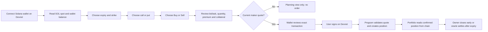
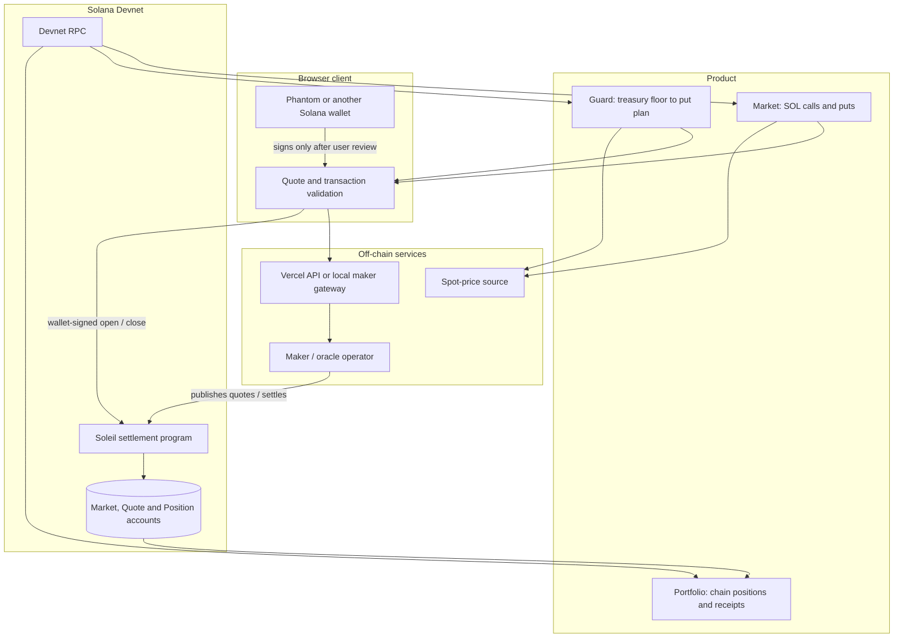
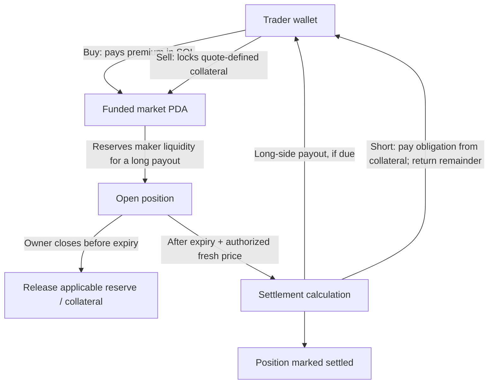
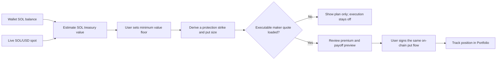

# Soleil — Judge Guide

## The 20-second explanation

Soleil is a Solana Devnet prototype for SOL options and treasury protection. A trader can inspect a compact SOL call/put chain; Guard turns an existing SOL balance and a chosen value floor into a put-protection plan; Portfolio reads confirmed positions from Solana. A maker gateway publishes bounded quotes, and the deployed program validates quote terms and records open, close, and expiry-settlement state on-chain.

**The product idea:** make downside protection for a SOL treasury easier to understand than a raw derivatives ticket, while keeping the market narrow enough to concentrate maker liquidity around SOL.

## First: how to read Bid and Ask

In each row, **Bid** is the price the maker is offering to pay to buy that option. **Ask** is the price the maker wants to receive to sell that option.

- Press **Buy**: you take the maker's ask and pay the premium.
- Press **Sell**: you take the maker's bid, receive premium, and take on the option-side obligation. Soleil requires collateral for sell positions.
- **Spread** = ask minus bid. It is the gap between the maker's buy and sell prices, not a fee by itself.

In the screenshot, the $110 put shows a $1.73 bid and a $1.89 ask. Those are USD prices per 1 SOL of option notional. For 0.11 SOL quantity, buying at that ask is about **$1.89 × 0.11 = $0.21** of premium, converted to SOL for the on-chain transfer, before network fees. Selling at the bid would receive roughly **$1.73 × 0.11 = $0.19** and require collateral. Final transaction terms come from the quote account, not from mental arithmetic on rounded display prices.

The screenshot's **“10 contracts” means five strike rows times two option types (call + put)**. It does not mean ten trades have happened. A **$110 put** benefits from a lower SOL price at expiry; a **$110 call** benefits from a higher price. The strike is the reference price and the expiry is when the contract ends. In Soleil's current program, expiry settlement pays cash value in SOL based on intrinsic value; it does not deliver SOL at the strike.

Each maker quote also has a **remaining size**. The current public quotes expose up to **0.10 SOL** each, so a 0.13 SOL order is larger than one quote can fill. That 0.10 SOL is the maker's configured quote capacity, not a protocol-wide maximum. The operator must fund the markets and publish larger quotes before larger single orders can execute.

## What the market screen shows

| Screen item | Plain-language meaning |
| --- | --- |
| Spot | Current SOL/USD market price used for display and planning. |
| Expiry | How long the option lasts (the app's configured 7-, 10-, or 14-day series). |
| Strike | The reference SOL price for one contract. |
| Call / Put | Higher-price exposure / lower-price exposure. |
| Bid / Ask | Maker buy price / maker sell price, respectively. |
| Quantity | SOL notional used to size the option. |
| IV | Estimated implied volatility; a model input, not a forecast. |
| Delta (Δ) | Approximate option-price sensitivity to a $1 change in SOL, per the displayed model. |
| “Awaiting maker” | The UI has not loaded usable maker terms; displayed model values are planning-only and cannot be submitted. |
| “Live maker quotes” | The app has received current quote references. A wallet still must review and sign the exact transaction. |

As checked on **2026-09-25**, the public `/api/health` endpoint reported configured and `/api/quotes` returned five 7-day strike rows with quote-account references. The attached screenshot's “Awaiting maker” label therefore looks like an old/unrefreshed UI state. Refresh the page and wait for quote loading before the demo. If it remains, refresh quotes once; do not describe model-only rows as executable.

## The user journey



## How the pieces fit



## Quote and order lifecycle

```mermaid
sequenceDiagram
    autonumber
    actor Trader
    participant UI as Soleil app
    participant Gateway as Maker gateway
    participant Wallet as Devnet wallet
    participant Program as Soleil program
    participant Chain as Devnet accounts
    Trader->>UI: Select SOL, expiry, strike, call/put, Buy/Sell
    UI->>Gateway: Request current quote series
    Gateway->>Chain: Read active market and quote accounts
    Chain-->>Gateway: Maker, side, price, size, nonce, expiry
    Gateway-->>UI: Quote rows with on-chain account references
    UI->>UI: Check market, side, freshness and available size
    UI-->>Trader: Show premium, collateral and transaction review
    Trader->>Wallet: Approve exact Devnet transaction
    Wallet->>Program: Submit signed open instruction
    Program->>Chain: Validate quote; transfer SOL; create position
    Chain-->>UI: Confirmed signature and position state
    UI-->>Trader: Show position in Portfolio
```

## Where money moves



The trader's wallet pays Solana network fees separately. Devnet SOL is test SOL, not money with real-world value. The maker's market liquidity is separate from the trader's wallet balance. A quote is not a guarantee of profit: a bought option can expire with no payout, and selling takes on an obligation backed by collateral.

## Guard: the product's differentiator

Guard starts with a treasury question rather than an options term: **“What minimum USD value do I want my SOL holdings to preserve?”** It reads the connected wallet's native SOL exposure, estimates the value from spot, accepts a floor and duration, then selects a put quote for review.



The chart is a scenario preview, **not a guaranteed floor**. Protection depends on the option terms, premium cost, executable liquidity and correct settlement.

## Project momentum: what exists now

This is implementation progress, not a claim about users, trading volume or adoption.

1. **Product surface:** Market, Guard and Portfolio are implemented in the web app.
2. **On-chain foundation:** the Soleil settlement program is deployed on Solana Devnet; market, quote and position accounts are program-derived.
3. **Real quote path:** the maker gateway publishes bounded quote accounts and the UI distinguishes these from indicative model estimates.
4. **Current hosted demo check (2026-09-25):** Vercel health returned `configured: true`; the seven-day quote endpoint returned five strike rows with maker quote-account references.
5. **Next engineering gates:** perform a fresh wallet-signed open/close/expiry-settlement demo; improve oracle independence and monitoring; add security review and stronger production risk controls before any mainnet or real funds.

The honest boundary matters: **Devnet reference prototype today; production derivatives venue is not claimed.** Settlement currently uses an authorized operator/oracle signer and native SOL. Independent production oracle design, thorough audit, operational monitoring and default/risk isolation remain future requirements.

## Five-minute judge demo

1. Open the [Devnet app](https://soleil-chi-three.vercel.app/#market) and show the status badge. Refresh quotes if it says “Awaiting maker”; show that the API returns quote accounts only after it loads.
2. Explain the $110 row: “Bid is the maker's price to buy this option; ask is the maker's price to sell. Buy crosses to ask; sell crosses to bid.” Show call vs put and expiry.
3. Change quantity and show premium/collateral estimates. Emphasize the wallet review is the signing boundary and all demo transactions use Devnet test SOL.
4. Open Guard: enter a treasury floor and show how it translates the user's goal into a put plan. Call the chart a scenario illustration.
5. If a demo wallet is funded and a current quote is available, show the transaction review. Only the human judge/demo operator should approve the wallet prompt. After confirmation, open Portfolio and the Explorer receipt.
6. Finish with the architecture flow above and state what is Devnet-complete versus production work still ahead.

If the wallet or a current quote is unavailable, stop at the review/planning state. Explain the disabled execution truthfully; do not claim a fill or fabricate a receipt.

## Useful judge links

- [Live Devnet app](https://soleil-chi-three.vercel.app/#market)
- [Solana Devnet program](https://explorer.solana.com/address/3xZZq7Wd23M1eyggca8KCbhNx6FcNpsKTHGJq751n66k?cluster=devnet)
- [Public maker health](https://soleil-chi-three.vercel.app/api/health)
- [Seven-day quote endpoint](https://soleil-chi-three.vercel.app/api/quotes?underlying=SOL&spot=111.94&expiryDays=7)
- [Detailed protocol and deployment notes](PROTOCOL.md) · [Deployment record](DEPLOYMENT.md) · [Maker runbook](MAKER.md)
