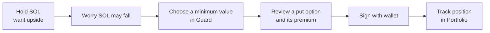
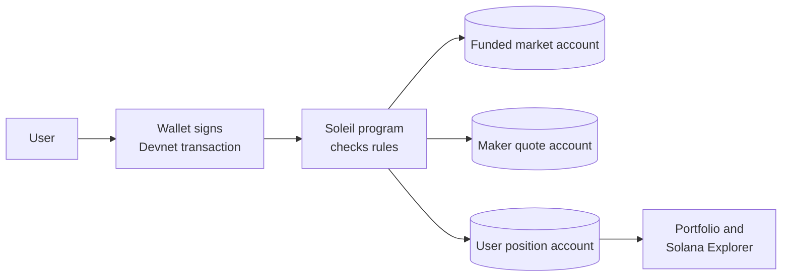
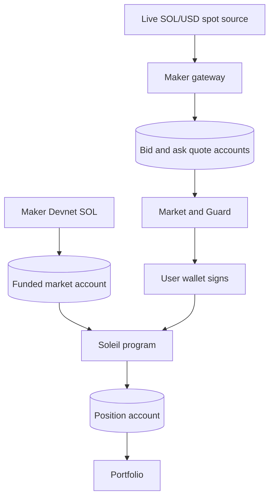
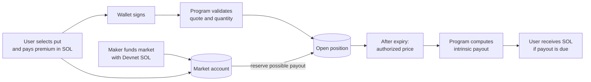

# Soleil judge pitch — Web3 from first principles

Use this page as a speaking script and screen-share map. The app is a Solana **Devnet** prototype. Devnet SOL is test currency; do not describe demo trades as real-money activity.

## The one sentence

**Soleil helps people protect SOL they already hold: choose a value floor in Guard, review a put option in Market, sign with a wallet, and verify the position on Solana.**

## Say this in 20 seconds

"If I hold SOL, I may want the upside but fear a sudden drop. A put option can pay when SOL falls, but options screens assume I already know strikes, premiums, and Greeks. Soleil starts with the question I actually have: 'How much of my treasury value do I want to protect?' Guard turns that into an option plan. Market shows an operator's on-chain quote, my wallet signs the trade, and a Solana program records the position. This is running on Devnet."

## Four-minute judge flow

| Time | Show | Say |
| --- | --- | --- |
| 0:00–0:30 | Market header and SOL price | “We focus on SOL. One asset keeps the first market understandable and concentrates limited maker liquidity.” |
| 0:30–1:15 | 7-day options chain | “Each row is a strike. Calls benefit from higher SOL prices; puts benefit from lower prices. Bid is what the maker pays to buy; ask is what I pay to buy.” |
| 1:15–2:00 | Select a **7-day put**, set quantity to **1 SOL**, show order ticket | “Quantity is the SOL amount protected, not a purchase of 1 SOL. The premium is the price of that protection. The current 7-day chain has on-chain 1 SOL quote capacity per contract.” |
| 2:00–2:45 | Guard | “Here I enter a minimum value for my existing wallet balance. Guard chooses a put plan and shows cost and possible expiry outcomes. The chart is a scenario, not a guaranteed return.” |
| 2:45–3:30 | Wallet review, then Portfolio and an Explorer receipt **if a transaction is confirmed** | “The wallet signs; our program checks the exact on-chain quote and creates the position. Portfolio reads program accounts. Explorer lets anyone verify a confirmed transaction.” |
| 3:30–4:00 | Architecture diagram below and program Explorer page | “This is a deployed Devnet program with funded markets and quote accounts. Independent oracle, audit, and production risk controls come before real funds.” |

If the wallet or quote endpoint is unavailable, show the planning screen and the deployed program/quote links. Never claim a transaction happened unless Explorer shows its confirmed signature.

## What we made different, and what follows existing markets

Soleil did **not** invent options, protective puts, bid/ask quotes, or market makers. Its product choice is to begin with an existing SOL holder's **value-floor goal**, derive a put plan from the wallet's native SOL balance, and connect that plan to a narrow SOL-only market and verifiable Solana position. Concentrating on SOL is a design choice to avoid spreading limited maker funds across many tokens. These are the project's differentiators, not claims that no other product has ever offered a hedge.

The options chain deliberately follows familiar market conventions: call and put contracts, strikes, expiries, bids, asks, premiums, spreads, quantity, and payoff diagrams. The TradingView SOL/USD chart and CoinGecko SOL spot reflect external market data. A real options market also has competing participants and prices formed through their bids and offers; Soleil does **not** have that independent price discovery yet.

Current maker quote accounts are real Devnet accounts and can be consumed by the deployed program. **Their prices are generated by Soleil's rule-based model** from spot, strike, assumed volatility, time to expiry, and a set spread. They are not prices imported from an established SOL options exchange. Displayed IV is an assumption rather than volatility inferred from traded option prices; Greeks are theoretical estimates. The strategy builder and protection chart are previews, not atomic multi-leg execution or guaranteed protection. Volume and open-interest fields are intentionally blank. Guard's 30-day choice is planning-only until a matching maker series exists.

Say it plainly to a judge: **“We built the user journey and the Devnet settlement path. We modeled initial maker pricing so that path is executable and testable. We have not built a competitive, market-discovered options order book.”**

Market references: [Options Industry Council on protective puts](https://www.optionseducation.org/strategies/all-strategies/protective-put-married-put), [option pricing](https://www.optionseducation.org/optionsoverview/options-pricing), and [bid/ask formation](https://www.optionseducation.org/news/understanding-the-bid-and-ask-prices-for-options).

## Diagram 1 — The human problem

**Example only:** Hold 1 SOL while its price is $120. Buy a $110 put. If the expiry price is $90, the SOL is worth $90 and the put's intrinsic payoff is $20 in USD terms. Combined gross value is $110 **before the premium and fees**. If SOL rises to $130, the put expires without intrinsic payoff, but the SOL still participates in the rise; the premium remains a cost. The program pays the option's cash value in SOL using the authorized expiry price. It does not exchange SOL at the strike.

| Word | Explain it this way |
| --- | --- |
| Option | Contract with a payoff tied to a future price. |
| Put | Pays intrinsic value when expiry price falls below the strike. |
| Call | Pays intrinsic value when expiry price rises above the strike. |
| Strike | Reference price, such as $110; not the premium. |
| Expiry | When the program can settle the payoff. |
| Premium | Amount paid to buy the option; a cost even when payoff is zero. |
| Quantity | SOL notional covered by the option. |
| Bid / ask | Maker's buy price / maker's sell price, shown per 1 SOL notional. |

## Diagram 2 — What makes this Web3

The website displays and prepares a transaction. The **wallet** authorizes it. The **program** enforces quote side, price, size, expiry, and market match before changing chain state. A **PDA** is an account address derived from program rules; Soleil uses separate market, quote, and position accounts. Explorer is independent evidence of confirmed chain activity.

This does **not** remove every trusted party. The maker funds markets and publishes prices. An authorized oracle signer supplies the expiry price. Production needs stronger oracle independence, audits, and operational controls.

## Diagram 3 — Who supplies price and liquidity

The maker's **bid** is the price it pays when the user sells an option. The maker's **ask** is the price the user pays when buying. The difference is the spread. A displayed model estimate is not a tradable quote. Soleil disables execution without usable on-chain quote terms.

## Diagram 4 — Follow one put trade and the SOL

For a **buy**, maximum option loss is the premium plus fees; the SOL holdings can still lose value. A **sell** is different: the user receives premium but must post collateral and can owe a payout. Keep the live demo on **Buy put** unless the judge asks about short options.

## What is live, and what is next

| Live on Devnet now | Still needed before mainnet |
| --- | --- |
| Deployed settlement program; funded SOL markets; on-chain bid/ask quote accounts | Independent production-grade expiry oracle and dispute design |
| Market, Guard, and Portfolio web flows | Security audit and stronger maker/key controls |
| Wallet-signed open instruction; program-enforced quote and liquidity checks | Monitored keeper operations and deeper risk/default controls |
| 7-day chain: five strikes × call/put, with 1 SOL bid/ask quote size per contract at last verification | More maker capital to support 1 SOL across 10- and 14-day chains |
| 10- and 14-day chains: 0.1 SOL quote size per contract at last verification | Mainnet deployment and real-money readiness |

**Quote size is capacity, not volume.** One 1 SOL quote does not mean 1 SOL has traded. Filling it consumes that quote's size; additional trades need fresh maker capacity. Quotes expire and can refresh. The maker's limited Devnet balance prevents claiming 1 SOL across all 30 markets today.

## Questions judges may ask

**Why Solana instead of a normal database?** The user's wallet signs; the program, not the web server, checks trade rules and updates accounts. Anyone can inspect confirmed transactions and position state. The current maker and oracle remain operational dependencies.

**What is new compared with an options chain?** Guard starts from a wallet's SOL exposure and a desired value floor. It translates that plain-language goal into a put plan, then uses the same verifiable Market execution path. The SOL-only scope also avoids launching dozens of empty token markets.

**Is this a decentralized exchange with live volume?** No. It is a Devnet reference venue with an operator maker. Do not claim users, volume, permissionless market making, or mainnet readiness.

**Why 7-, 10-, and 14-day tabs?** They are distinct expiry series. The program has separate market accounts per expiry, strike, and call/put kind. Each needs its own liquidity, which is why current quote sizes differ.

**Can I sell or exit early?** The program supports buying and collateralized selling. A long owner can abandon a position before expiry, which releases its reserve; that is **not** a resale for a premium. There is no general secondary exit market in this prototype.

**What if SOL falls?** A put's intrinsic value increases below its strike. The payout is calculated at expiry from the authorized price. Premium, contract size, available collateral/liquidity, and settlement rules still matter.

## Proof links to keep open

- [Live Market](https://soleil-chi-three.vercel.app/#market)
- [Deployed Soleil program on Solana Explorer](https://explorer.solana.com/address/3xZZq7Wd23M1eyggca8KCbhNx6FcNpsKTHGJq751n66k?cluster=devnet)
- [Live 7-day quote endpoint](https://soleil-chi-three.vercel.app/api/quotes?expiryDays=7)
- [Maker service health](https://soleil-chi-three.vercel.app/api/health)
- [Detailed judge guide](JUDGE_GUIDE.md) and [protocol notes](PROTOCOL.md)
